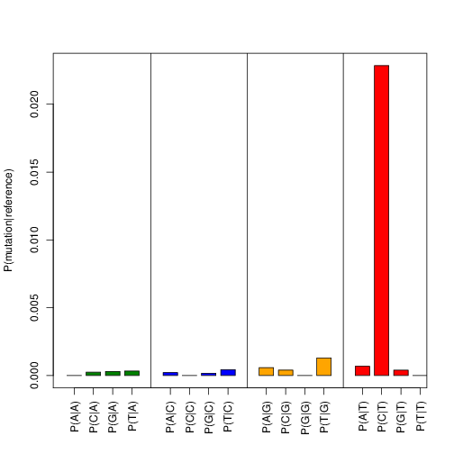
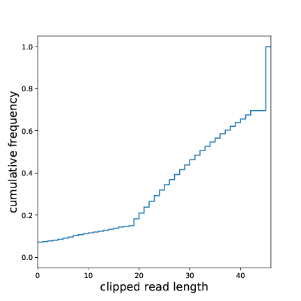
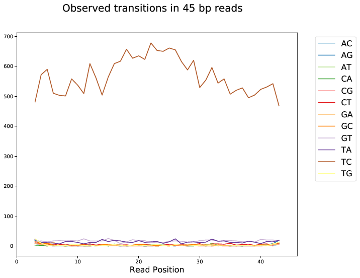

Getting started
###############

Overview
********

mockinbird is a highly configurable PAR-CLIP processing pipeline that performs quality assessment,
read alignment, PAR-CLIP interaction site prediction and visualization automatically.

A recent study has found that unspecific background binding is present in PAR-CLIP data sets,
despite of the immunprecipiation followed by stringent washing steps :cite:`friedersdorf2014advancing`,

In contrast to previously published PAR-CLIP site prediction methods such as PARalyzer :cite:`corcoran2011paralyzer`, wavClusteR :cite:`comoglio2015sensitive` or PIPE-CLIP :cite:`chen2014pipe`,
our model integrates background binding information from a PAR-CLIP mock experiment and thus can
distinguish factor specific protein-RNA binding from unspecific interactions.

Our model is integrated in a modular, highly configurable and easily extenable PAR-CLIP pipeline.

To use our PAR-CLIP binding model you need:

#. a PAR-CLIP data set from a factor of interest (fastq reads)
#. a mock PAR-CLIP experiment measuring background binding (fastq reads)

Please note that our model learns background binding strength from the mock to calculate p-values.
Ideally the background binding should thus be measured under the same conditions as the factor of interest.

The pipeline is divided into two steps:

#. In the **preprocessing** phase PAR-CLIP binding sites are predicted from raw PAR-CLIP reads.

#. The **postprocessing** step runs automatized downstream analyses on the predicted binding sites.

Tutorial
********

Getting started
===============

In this tutorial we are processing PAR-CLIP data of the `Nrd1 <http://www.yeastgenome.org/locus/S000005195/overview>`_ protein in S. cerevisiae.
For more information on the biological role of Nrd1 and the PAR-CLIP experiment, please refer to :cite:`schulz2013transcriptome`.

Please follow this link and download `mockinbird_tutorial.tar.gz <https://TODO.todo>`_ which contains all data required for completing this tutorial.

Running the preprocessing
=========================

The preprocessing can be started from the tutorial directory by running

::

        mockinbird preprocess nrd1 nrd1 preprocess.yaml

in a standard installation, or

::

        docker run -v $PWD:/data soedinglab/mockinbird preprocess nrd1.fastq nrd1 nrd1 preprocess.yaml

in case you are using the docker container.

Inspecting the results
----------------------

Checking reads and mapping
^^^^^^^^^^^^^^^^^^^^^^^^^^

The number of generated files may be daunting at first. Following route can be used to obtain a
first impression of the data.

First have a look at the mapping output, which is printed to stdout and
can also be found in ``preprocess.log``

::

        # reads processed: 20442544
        # reads with at least one reported alignment: 1273512 (6.23%)
        # reads that failed to align: 17229731 (84.28%)
        # reads with alignments suppressed due to -m: 1939301 (9.49%)
        Reported 1273512 alignments to 1 output stream(s)

A sufficient number of mapped reads is crucial for predicting high confidence binding sites.

Now check ``transition_frequencies_nuc_mutations.pdf`` and verify that
the characteristic PAR-CLIP mutation (T->C for 4sU) is the dominant transition:

   Transition frequencies

   Frequencies of the individual transitions. The PAR-CLIP specific mutation (here T->C)
   is significantly higher than any other mutation.

The ``FastQC`` reports in ``fastQC_raw`` and ``fastQC_clipped`` can be consulted to obtain
a general overview over the sequencing library. It is recommended to pay attention to the
read quality and the overrepresented sequences.

A quick glance at ``clipped_len_distr.pdf`` will give an overview over the size
distribution of the RNA inserts. The optimal size distribution depends on the the genome size.
For yeast we will only map reads of size 20 nt and longer. More than 80% of the clipped reads are
therefore eligible for mapping.

   Insert size distribution

   Cumulative size distribution of RNA inserts.

Checking transition profiles
^^^^^^^^^^^^^^^^^^^^^^^^^^^^

:ref:`module_bam_analysis` creates a ``bam_analysis`` folder with several diagnostic plots that
give a more detailed overview over the transition properties in reads.

:ref:`module_bam_analysis` also allows to manipulate and filter aligned reads.
All diagnostic plots are created twice. The plots before filtering can be found in the subfolder
``pre_fil_data``.
Plots after filtering are stored in ``post_fil_data``.

First browse through the transition profiles after filtering. The PAR-CLIP specific mutation should
dominate all other transitions and be roughly uniformly distributed over all positions.
Spikes at specific positions hint towards mismapping and/or abundance of PCR duplicates. The ratio
of specific to unspecific mutations will drop towards the ends of the reads due to (adapter)
contamination. You may want to drop mutations at the edges. Please refer to the documentation of
:ref:`module_bam_analysis` for configuration details.

Transition profiles will degenerate for shorter read lengths. Increasing the minimum length of accepted
alignments will therefore increase the signal to noise ratio.

   Transition profile for alignments of length 45 bp

   The PAR-CLIP specific T->C mutation dominates all other mutations and is reasonably smooth.
   Watch out for spikes in the curves as they are indicators of unwanted PCR duplication and
   mismapping. If the specific T->C mutation rate drops at the ends you can drop mutations at the
   edges.

Additional aspects
^^^^^^^^^^^^^^^^^^

The ``bam_analysis`` folder contains several other plots that help chosing suitable pipeline
configuration options:

- ``mismatch_profiles``: the total mutation frequency profiles per position
- ``length_transition_plot.pdf``: the PAR-CLIP specific mutation frequency for different alignment sizes
- ``quality_transition_plot.pdf``: the PAR-CLIP specific mutation frequency for different quality scores
- ``mapped_lengths.pdf``: the length frequencies of aligned reads

The configuration file
----------------------

The pipeline configuration of the preprocessing run can be found in ``preprocess.yaml``.

In the following the preprocessing file for the tutorial is explained in more depth:

::

        

        
        
        
        
        

        # setting mock_processing to True will only process the mock. Setting to `False` will run the full
        # pipeline
        

The first block uses `jinja <http://jinja.pocoo.org/docs/latest/>`__ syntax to define a set of
variables. Note that paths are defined relative to ``preprocess.yaml``.

::

        general:
            adapter5prime: GTTCAGAGTTCTACAGTCCGACGATC
            adapter3prime: TGGAATTCTCGGGTGCCAAGG
            genomefasta: {{ genome_fasta }}
            normalization_pileup: {{ norm_pileup }}
            rmTemp: yes
            n_threads: 4

        reads:
            bc_5prime: 5
            bc_3prime: 0
            min_len: 20
            reference_nucleotide: T
            mutation_nucleotide: C

The second block defines general and read-specific configuration. For a description of the flags
please refer to the section on :ref:`preprocess_cfg`.

The next parts define the preprocessing pipeline.

::

        pipeline:
            - FastQCModule:
                outdir_name: fastQC_raw

            - UmiToolsExtractModule

            - SkewerAdapterClippingModule

            - ClippyAdapterClippingModule:
                clipped_5prime_bc: True

            - FastQCModule:
                outdir_name: fastQC_clipped

The tutorial pipeline performs following steps before mapping:

        - a report of the quality of the raw reads is generated using ``FastQC``
        - ``umi_tools`` removes the five random nucleotides from the 5' end of the reads
        - ``skewer`` clips the 3' sequencing adapter
        - ``clippy`` clips 5' adapters and drops adapter dimers
        - finally a second ``FastQC`` report is generated to check the clipping results

::

    - BowtieMapModule:
        genome_index: {{ bowtie_index }}

    - BamPPModule:
        remove_n_edge_mut: 2
        max_mut_per_read: 1
        min_mismatch_quality: 20

    - SortIndexModule:
       keep_all: yes

    - UmiToolsDedupModule

    - SortIndexModule:
       keep_all: yes

    - PileupModule:
       keep_all: yes

    - BamStatisticsModule

The second set of modules

- maps the clipped reads with ``bowtie``
- postprocesses the obtained alignments and plots transitions statistics
- removes PCR duplicates
- calculates an ``mpileup`` file
- calculates bam statistics

If ``mock_processing`` is set to ``True``, the pipeline ends here, as the ``mpileup`` file and the
bam statistics of the mock are required for the prediction modules.

When processing a factor of interest, the following modules run the mock-based prediction:

::

        

            - PredictionSitesModule:
                sites_file: {{ data_dir }}/genome.sites
                fasta_file: {{ genome_fasta }}
                transition_nucleotide: T

            - MockTableModule:
                mock_table: {{ data_dir }}/mock.table
                mock_pileup: {{ mock_pileup }}

            - TransitionTableModule

            - LearnMockModule:
                mock_model: mock_model/model.pkl
                mock_statistics: {{ mock_statistics }}
                n_mixture_components: 5
                em_iterations: 250

            - MockinbirdModule

            - NormalizationModule
            - QuantileCapModule
        

The last steps calculate an occupancy by dividing the number of transitions by
the coverage of an RNAseq experiment conducted under PAR-CLIP conditions and cap the occupancy
values at the ``0.95`` quantile.

The final output is a ``.table`` file. We will create plots from it in section :ref:`tutorial_postprocess`.

.. _tutorial_postprocess:

Running the postprocessing
==========================

The postprocessing can be started from the tutorial directory by

::

        mockinbird postprocess nrd1 nrd1_pp postprocess.yaml

in a standard installation, or

::

        docker run -v $PWD:/data soedinglab/mockinbird postprocess nrd1 nrd1_pp postprocess.yaml

in case you are using the docker container.

The output of the preprocessing phase is a PAR-CLIP table file, here ``nrd1_capped.table``.
Each line lists one predicted PAR-CLIP binding site, along with the number of PAR-CLIP transitions,
the read coverage, a confidence and an occupancy score and the estimated posterior probability:

::

        seqid   position        transitions     coverage        score   strand  occupancy       posterior
        chrI    32601   4       4       6.352710158543762       -       0.15384615384615385     0.772109761967
        chrI    35562   4       5       5.292152965717071       +       0.0223463687150838      0.539841709238
        chrI    35805   5       5       9.376254703871467       +       0.03184713375796178     0.98585024515

The postprocessing pipeline allows to do general purpose downstream analyses:

Meta-gene plot
--------------

Meta gene plots visualize the PAR-CLIP signal over the body of aligned annotations (meta-genes).

:ref:`_centerplot_bs` creates a metagene plot that is aligned at the start and end of the annotation.

.. figure:: imgs/centerplot.png
   :alt: meta-gene plot
   :align: center

   Meta-gene plot of the PAR-CLIP occupancies.

   TIF-seq annoations are aligned at the start and end. The sense strand is depicted in blue,
   the antisense strand is colored in green. The shaded area covers 95% bootstrap confidence
   intervals.

In this example we align TIF-seq gene annotation :cite:`pelechano2013extensive`.
95% confidence intervals calculated by bootstrap sampling the annotations are shaded.

The configuration file
----------------------

``postprocess.yaml`` contains the configuration of the postprocessing pipeline used for the tutorial.

In the beginning several ``jinja`` variables are defined for later use.

::

        

        
        
        
        
        
        

        
        

The first module removes PAR-CLIP sites falling into `tRNA`, `snRNA`, `snoRNA` and `rRNA` from the
table file.

::

        pipeline:

            - GffFilterModule:
                filter_gff: {{ filter_gff }}
                padding_bp: 10
                features:
                    - tRNA_gene
                    - snRNA_gene
                    - snoRNA_gene
                    - rRNA_gene
                file_postfix: filtered
                keep_all: yes

Training your own mock model
============================

In this tutorial we shipped our trained mock model. If you are applying mockinbird
to your own data, you may want to include your own mock experiment.

For more information on measuring a mock experiment, please refer to :ref:`TODO`.

Training your own mock model with your own mock PAR-CLIP ``fastq`` file takes following steps:

#. Set the ``mock_processing`` jinja variable in ``preprocess.yaml`` to ``True``. This will stop the pipeline after having created the mock ``mpileup`` file and the ``bam statistics``.

#. Run the preprocessing pipeline with the mock fasta file.

#. Set the ``mock_pileup`` and ``mock_statistics`` variables to the calculated mock files.

#. Go into the ``data`` directory and delete ``mock.table``, and all files in the ``mock_model`` subdirectory.

#. Set ``mock_processing`` back to ``False``.

The next time you run the pipeline ``mock.table`` and the model itself will be recreated from the new data.

Pipeline configuration
**********************

The preprocessing and the postprocessing are each controlled by a config file in the easily
readable `yaml <https://en.wikipedia.org/wiki/YAML>`_ format.
The template engine `jinja <http://jinja.pocoo.org>`__ is used to allow complex and flexible work
flows.

At the heart of the configuration is the `pipeline` section which defines the ``Pipeline``, that
is the sequence of modules that are to be executed.

A very simple example pipeline definition is

::

    pipeline:
       - BowtieMapModule:
           genome_index: bowtie_index/genome
       - PileupModule

which would call the bowtie mapper with the bowtie index prefix ``bowtie_index/genome`` relative
to the config file and then uses the ``PileupModule`` to finally output a file in the ``mpileup``
format.

Every module is enumerated by a leading dash and can be configured individually. Output of modules
are chained and are used as inputs of the following modules. The pipeline tracks the most recent
file of each file format. A module requiring a ``fastq`` file will therefore always use the
``fastq`` created by the most recent module that outputs a ``fastq`` file.

.. _preprocess_cfg:

Preprocessing configuration
===========================

In addition to the ``pipeline`` section, the preprocessing config file also contains the two
configuration sections ``general`` and ``reads`` which provide global configuration
options accessible to all modules.

Options of the ``general`` section:

====================  =================  ============================================================
Parameter             Default value      Description
====================  =================  ============================================================
adapter5prime                            Sequence of the 5' sequencing adapter
adapter3prime                            Sequence of the 3' sequencing adapter
genomefasta                              Path to organism's genome fasta file. Fasta file has to
                                         have a fasta index (.fai) file
normalization_pileup                     pileup file with normalization sequences. No normalization
                                         will be done if the file is empty.
rmTemp                True               remove temporary files
n_threads             2                  number of parallel threads that should be run (if supported)
====================  =================  ============================================================

Options of the ``reads`` section:

====================  =================  ============================================================
Parameter             Default value      Description
====================  =================  ============================================================
bc_5prime             0                  length of the 5' barcode
bc_3prime             0                  length of the 3' barcode
min_length            20                 minimum length of alignments
reference_nucleotide  T                  nucleotide expected in reference for the PAR-CLIP specific
                                         conversion
mutation_nucleotide   C                  nucleotide observed for the PAR-CLIP specific conversion
====================  =================  ============================================================

Postprocessing configuration
============================

The postprocessing config file contains only the ``pipeline`` section.
The pipeline starts initially with the path to a ``table`` file.

Expert options
==============

jinja templating
----------------

You can use the powerful jinja template engine to define variables and manipulate variables and
use control flow statements like conditional clauses and loops.

A simple example that uses a variables:

::

        
        

        pipeline:
          - MyGenomeModule:
              genome: {{ genome_fasta }}

For a indepth explanation of jinja, please refer to their
`documentation <http://jinja.pocoo.org/docs/>`_.

Setting initial files
---------------------

Some modules require input files and thus rely on modules creating these files as output.
The pipeline starts with initial formats, that is ``fastq`` for the preprocessing pipeline and
``table`` for the postprocessing pipeline.

In the ``custom_files`` section it is possible to register additional initial files with their
formats:

::

        custom_files:
          bam: /path/to/file.bam
          mpileup: /path/to/file.mpileup

