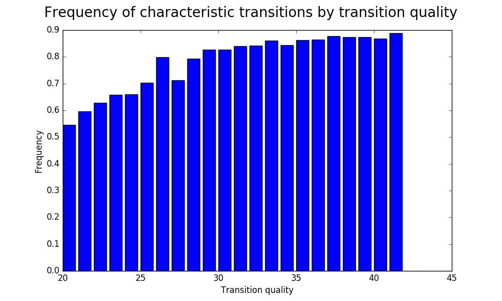
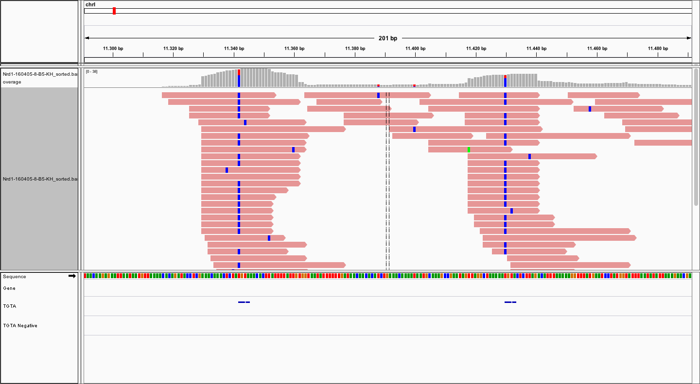

Preprocessing
=============

Getting started
---------------
The aim of the preprocessing pipeline is to convieniently execute all required steps to transform a raw PAR-CLIP fastq file into a list of PAR-CLIP sites bound by the factor of interest.

In addition to predicting PAR-CLIP sites, the preprocessing pipeline also generates plots that help assessing the quality of the experiment or help to choose good parameters.

``stammp-preprocess`` (see :ref:`ref_script_preprocess`) is the central script to start the preprocessing pipeline.
It takes a fastq file with PAR-CLIP reads and a config file which defines all configurable parameters and options (see :ref:`ref_preprocess_config` for a detailed description of all options).
The config file and the raw fastq reads together allow a unified, reproducible preprocessing procedure.

.. _ref_script_preprocess:

Command line script
-------------------

.. argparse::
  :module: stammp.scripts.preprocess
  :func: create_parser
  :prog: stammp-preprocess

.. _ref_preprocess_config:

Configuration reference
-----------------------

General
~~~~~~~

General information about the experiment and resources

====================  =======  =============================================
Option                Default  Description
====================  =======  =============================================
adapter5prime           None   Nucleotide sequence of the 5' adapter
adapter3prime           None   Nucleotide sequence of the 3' adapter
genomeindex             None   Path to the STAR genome directory
genomefasta             None   Path to fasta file with the genome sequence
normalization_pileup    None   Path to pileup file used for normalization
rmTemp                  yes    Clean up temporary files
n_threads                2     Use up to n parallel threads where applicable
====================  =======  =============================================

.. _ref_read_config:

Reads
~~~~~

Information about the reads and the characteristic mutation (T->C by default)

====================  =======  =============================================
Option                Default  Description
====================  =======  =============================================
fx_Q33                yes      Use Sanger or Illumnina scores
bc_5prime             0        Size of the 5' barcode (in bp)
bc_3prime             0        Size of the 3' barcode (in bp)
min_len               20       Minimum aligment size (in bp)
reference_nucleotide  T        Nucleotide expected in the Reference
mutation_nucleotide   C        Nucleotide expected in the Alignment
====================  =======  =============================================

Pipeline
~~~~~~~~

Activation and deactivation of individual pipeline steps

====================  =======  =============================================
Option                Default  Description
====================  =======  =============================================
remove_duplicates     yes      Remove PCR duplicates. Works best with
                               5' adapters with random barcode
fastqc_statistics     yes      Generate fastqc report for a quick overview
                               over the sequencing reads
adapter_clipping      yes      Clip sequencing adapters before mapping
quality_trimming      no       Trim low quality bases at the end of the read
quality_filtering     no       Remove reads that do not meet quality standards
mapping               STAR     mapper for read alignment
====================  =======  =============================================

.. _ref_special_options:

Special configuration options
~~~~~~~~~~~~~~~~~~~~~~~~~~~~~

**fastQC**

Options for the fastqc toolkit

====================  =======  =============================================
Option                Default  Description
====================  =======  =============================================
kmer_length           7        Size for search of overrepresented kmers
extra_flags                    Comma separated list of arguments to be passed
                               to fastqc
====================  =======  =============================================

**clippyAdapterClipper**

Options for the adapter clipper. Adapter clipping removes partial adapters
from the reads and discards adapter dimers and reads with too short insertions
It searches for partial adapters (3' end of the 5' adapter) and (5' end of 3'
adapter)

====================  =======  =============================================
Option                Default  Description
====================  =======  =============================================
clip_len              10       Minimum bp required for adapter identification.
====================  =======  =============================================

**fastxQualityTrimmer**

Options for the fastx quality trimmer. (Not activated by default)

====================  =======  =============================================
Option                Default  Description
====================  =======  =============================================
quality_cutoff        30       Trim bases at the ends with quality lower than
                               <quality_cutoff>
====================  =======  =============================================

**lafugaQualityFilter**

Options for the quality filter. (Not activated by default)

====================  =======  =============================================
Option                Default  Description
====================  =======  =============================================
quality_cutoff        30       Remove reads with bases of quality lower than
                               <quality_cutoff>
chastity              no       Keep reads with Illumina chastity flag
remove_n              yes      Remove reads with unknown bases
====================  =======  =============================================

**STAR**

Options for the STAR aligner

====================  =======  =============================================
Option                Default  Description
====================  =======  =============================================
n_multimap            1        Number of genomic positions the read is allowed
                               to map to. (1 = unique mapping)
n_mismatch            1        Allow up to <n_mismatch> mismatches in the aligment
allow_soft_clipping   yes      do a local alignment
extra_flags                    Comma separated list of arguments to be passed
                               to STAR
====================  =======  =============================================

**PostProcessing**

Options for the alignment postprocessing script

====================  =======  =============================================
Option                Default  Description
====================  =======  =============================================
remove_n_edge_mut     0        Remove mutations that are within <remove_n_edge_mut>
                               bp to the start or the end of the alignment
max_mut_per_read      1        Drop alignments with more than <max_mut_per_read>
                               mutations
min_base_quality      0        Drop alignments with base qualities lower than
                               <min_base_quality>
min_mismatch_quality  20       Drop alignments with transitions in bases with
                               a quality score less than <min_mismatch_quality>
dump_raw_data         no       Output additional mutation data for manual analysis
====================  =======  =============================================

**bsfinder**

Options for the binding site finder module

====================  =======  =============================================
Option                Default  Description
====================  =======  =============================================
pval_threshold        0.005    P-value threshold for reporting binding sites
min_cov               2        Minimum coverage required for reporting binding
                               sites
====================  =======  =============================================

**normalizer**

Options for the normalization module

====================  =======  =============================================
Option                Default  Description
====================  =======  =============================================
mut_snp_ratio         0.75     Minimum ratio of mutations in the normalization
                               data required for SNP calling
====================  =======  =============================================

**max_quantile**

Options for the max_quantile module. Outlier can distort plots. This module caps
the occupancy values at a given quantile.

====================  =======  =============================================
Option                Default  Description
====================  =======  =============================================
max_quantile          0.95     Capping quantile for occupancy
====================  =======  =============================================

Interpreting the results
------------------------

The preprocessing script produces quite a number of files::

        .
        ├── bam_analysis
        │   ├── 3prime_clipped.txt
        │   ├── 5prime_clipped.txt
        │   ├── post_fil_data
        │   │   ├── length_transition_plot.png
        │   │   ├── mapped_lengths.png
        │   │   ├── mismatch_profiles
        │   │   │   ├── mismatch_freq_<xx>bp.png
        │   │   ├── quality_transition_plot.png
        │   │   ├── raw_data
        │   │   │   └── mismatch_data.tab
        │   │   └── transition_profiles
        │   │       ├── transition_<xx>bp_plot.png
        │   └── pre_fil_data
        │       ├── length_transition_plot.png
        │       ├── mapped_lengths.png
        │       ├── mismatch_profiles
        │       │   ├── mismatch_freq_<xx>bp.png
        │       ├── quality_transition_plot.png
        │       ├── raw_data
        │       │   └── mismatch_data.tab
        │       └── transition_profiles
        │           ├── transition_<xx>bp_plot.png
        ├── fastQC_filtered
        │   ├── Spt5_adapter.clipped_fastqc.html
        │   └── Spt5_adapter.clipped_fastqc.zip
        ├── fastQC_raw
        │   ├── Spt5-140311-2-B5-Hi.fastqsanger_fastqc.html
        │   └── Spt5-140311-2-B5-Hi.fastqsanger_fastqc.zip
        ├── preprocess.log
        ├── Spt5_logfile.txt
        ├── Spt5.mpileup
        ├── Spt5.normed_table
        ├── Spt5.qtable
        ├── Spt5_sorted.bam
        ├── Spt5_sorted.bam.bai
        └── STAR_output
            ├── Spt5_Aligned.sortedByCoord.out.bam.bai
            ├── Spt5_Log.final.out
            ├── Spt5_Log.out
            ├── Spt5_Log.progress.out
            └── Spt5_SJ.out.tab

The following paragraphs give guidance on how to approach the preprocessing data

First impression
~~~~~~~~~~~~~~~~

Check ``preprocess.log`` for a first impression. Low PCR duplication levels, little adapter clipping and a high percentage of reads with transitions are indicators for
a successful experiment. Following questions can be answered from the log file.

     - What percentage of the reads are PCR-duplicates?
     - How many reads are too short or adapter dimers?
     - What percentage of aligments have a transition?
     - How many PAR-CLIP sites were called?

FastQC reports
~~~~~~~~~~~~~~

FastQC generates a detailed overview over the sequencing reads. The reports are in html format and can be viewed in your favorite web browser. STAMMP generates two FastQC reports: one with the original fastq file in the folder ``fastQC_raw`` and one in ``fastQC_filtered`` with the postprocessed reads right before mapping.

You may want to check the ``Per base sequence quality`` plot and make sure that the sequences in the ``Overrepresented sequences`` section can be explained by the experiment design (sequencing adapters, etc.)

Transition profiles
~~~~~~~~~~~~~~~~~~~

PAR-CLIP experiments introduce a specific transition (commonly T->C) that can be used to validate the success of the experiment and of the mapping strategy.
STAMMP uses a postprocessing step to filter low quality alignments. ``bam_analysis/post_fil_data`` contains plots for sanity checks.
The plots in ``bam_analysis/pre_fil_data`` can be used to find optimal parameters for the postprocessing script.

The folder ``bam_analysis/post_fil_data/transition_profiles`` contains plots that visualize the transition frequency at each position of alignments of a fixed size.

.. _fig_transition_profile:

.. figure:: imgs/transition_45bp_plot.png
  :height: 400px
  :width: 600 px
  :align: center

  Transition profile of all 45bp alignments

:numref:`fig_transition_profile` shows the transition profile of 45bp alignments. In successfull experiments the line for the the characteristic T->C mutation (here brown line) is more higher than any other transition.
Note that in general transitions become more frequent at the start and end of the aligment.
For reads without mismatches the local aligment strategy tries to spend the allowed mismatch to extend the aligment by including parts of the contaminant.

The STAMMP pileline can remove transitions at the aligment ends, see the ``remove_n_edge_mut`` postprocessing option in :ref:`ref_special_options`.
By default STAMMP supresses transitions in the three first and last bases of the alignment.
Depending on the experiment this may be too stringent or too lenient.
For choosing a good cutoff, compare to the corresponding plot in ``bam_analysis/pre_fil_data/transition_profiles`` and estimate the number of wrongly called transitions of interest.

The attentive reader may have noticed the periodic pattern in the T->C transitions.
This is an artifact due to RNase-T preferentially cutting after Guanine nucleotides which, in combination with specific codon usage, produces the perodic pattern.

Clipped sequences
~~~~~~~~~~~~~~~~~

Local aligments make it possible to find potential contaminants during mapping phase.
The files ``bam_analysis/5prime_clipped.txt`` and ``bam_analysis/3prime_clipped.txt`` contain the most commonly clipped sequences.

This is the output for clipped sequences from the 3' end of size 9bp::

        clipped bases: 9 | clipped sequences: 127622

        TGGAATTCT                           45861
        GATCGTCGG                           21864
        ACTCTGAAC                            2008
        GATCGGATC                             743
        GGATCGTCG                             703
        GATCGTGAT                             665
        GATCGTCGT                             522
        GATCGATCG                             494
        GATGATCGT                             380
        AAAAAAAAA                             336

Here the most common contaminant ``TGGAATTCT`` is the prefix of the 3' adapter. Several reads have been stripped from poly-A tails (``AAAAAAAAA``). The remaining sequences contain reverse complemented sequences of the 5' adapter.

Carfully investigating the clipped sequences can help understanding protocol problems.
Most of the common contaminants can be identified by comparing them and their (reverse) complements to adapters and sequencing primer sequences.

Transition quality
~~~~~~~~~~~~~~~~~~
Modern sequencers also estimate the probability of a sequenced base being correctly called.
The ratio of observed characteristic transitions can be used to estimate the fraction of wrongly called transitions.

``bam_analysis/post_fil_data/quality_transition_plot.png`` shows the frequency of characteristic mutations depending on the quality estimated by the sequencer.
The corresponding plot in ``pre_fil_data`` contains all transitions before read filtering and can be used to choose the quality cutoff option ``min_mismatch_quality`` postprocessing option (see :ref:`ref_special_options`).

  Fraction of characteristic mutations depending on the base quality.
  Transitions with a base quality lower than 20 are filtered out.

Minimum alignment size
~~~~~~~~~~~~~~~~~~~~~~

The shorter the alignment, the higher the chance that the read has been aligned wrongly.

``bam_analysis/post_fil_data/length_transition_plot.png`` shows the frequency of characteristic mutations depending on the alignment length.
The corresponding plot in ``pre_fil_data`` contains the same plot for all alignments before filtering and can be used to find a suitable minimum aligment length option ``min_len`` (see :ref:`ref_read_config`).

.. figure:: imgs/length_transition_plot.png
  :align: center

  Fraction of characteristic mutations depending on the alignment length.
  Alignments shorter than 20 bp are filtered out.

Further analysis
~~~~~~~~~~~~~~~~

Before using the postprocessing pipeline to visualize PAR-CLIP sites genome-wide looking at individual strong PAR-CLIP sites can help familiarizing with the data and generating initial hypotheses.

The `Integrated Genomics Viewer (IGV) <https://www.broadinstitute.org/igv/>`_ is a powerful tool for visualizing sequencing data.
It can e.g. be used to inspect RNAseq, factor and mock PAR-CLIP reads side-by-side and also highlight short sequencing motifs.

It is highly recommended to browse through a few strong PAR-CLIP sites before continuing with the postprocessing.

  IGV visualization of two strongly bound PAR-CLIP sites of the factor Nrd1. The binding motif ``TGTA`` is present in both motifs.
