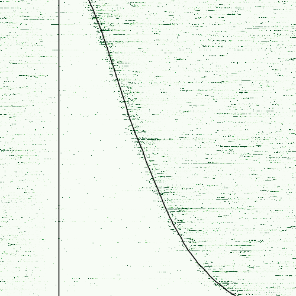
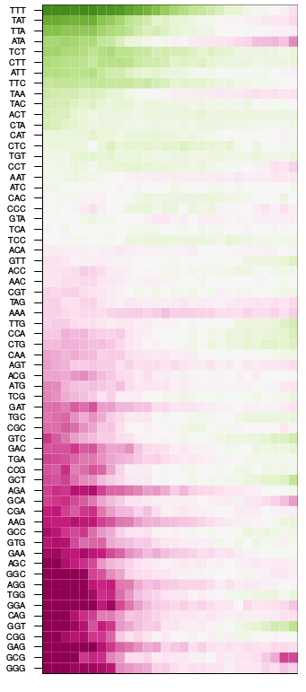

Script Reference
================

Utility Scripts
---------------

.. _ref_script_configgen:

stammp-generateConfig
~~~~~~~~~~~~~~~~~~~~~

.. argparse::
  :module: stammp.scripts.generate_config
  :func: create_parser
  :prog: stammp-generateConfig

.. _ref_script_makenegsets:

stammp-makeNegSets
~~~~~~~~~~~~~~~~~~

.. argparse::
  :module: stammp.scripts.makeNegSets
  :func: create_parser
  :prog: stammp-makeNegSets

.. _ref_script_xxmotif:

stammp-xxmotif
~~~~~~~~~~~~~~

.. argparse::
  :module: stammp.scripts.xxmotif
  :func: create_parser
  :prog: stammp-xxmotif

stammp-bam-postprocess
~~~~~~~~~~~~~~~~~~~~~~

.. argparse::
  :module: stammp.scripts.bam_postprocessing
  :func: create_parser
  :prog: stammp-bam-postprocess

stammp-removePCRduplicates
~~~~~~~~~~~~~~~~~~~~~~~~~~

.. argparse::
  :module: stammp.scripts.utils.removePCRduplicates
  :func: create_parser
  :prog: stammp-removePCRduplicates

stammp-adapter-clipper
~~~~~~~~~~~~~~~~~~~~~~

.. argparse::
  :module: stammp.scripts.utils.clipper53
  :func: create_parser
  :prog: stammp-adapter-clipper

stammp-softclip-analyzer
~~~~~~~~~~~~~~~~~~~~~~~~

.. argparse::
  :module: stammp.scripts.utils.clipped_seq
  :func: create_parser
  :prog: stammp-softclip-analyzer

stammp-normalize
~~~~~~~~~~~~~~~~

.. argparse::
  :module: stammp.scripts.normalize
  :func: create_parser
  :prog: stammp-softclip-analyzer

stammp-bsfinder
~~~~~~~~~~~~~~~~

.. argparse::
  :module: stammp.scripts.bsfinder
  :func: create_parser
  :prog: stammp-bsfinder

stammp-convert2quantile
~~~~~~~~~~~~~~~~~~~~~~~

.. argparse::
  :module: stammp.scripts.convert2quantile
  :func: create_parser
  :prog: stammp-convert2quantile

.. _ref_script_filter_sites:

stammp-filter-sites
~~~~~~~~~~~~~~~~~~~

.. argparse::
  :module: stammp.scripts.filter_sites
  :func: create_parser
  :prog: stammp-filter-sites

Plotting scripts
----------------

.. _ref_script_center_plot:

stammp-makeCenterBothEnds
~~~~~~~~~~~~~~~~~~~~~~~~~

.. image:: imgs/img_plotCenterBoth.png
  :align: center

.. argparse::
  :module: stammp.plots.makeCenterBothEnds
  :func: create_parser
  :prog: stammp-makeCenterBothEnds

.. _ref_script_heatmap:

stammp-makeHeatMap
~~~~~~~~~~~~~~~~~~

.. image:: imgs/img_pub1_heatmap_sense.png
  :align: center

.. argparse::
  :module: stammp.plots.makeHeatMap
  :func: create_parser
  :prog: stammp-makeHeatMap

.. _ref_script_heatmap_small:

stammp-makeHeatMapSmall
~~~~~~~~~~~~~~~~~~~~~~~

.. image:: imgs/img_pub1_heatmap_sense_small.png
  :align: center

.. image:: imgs/img_pub1_heatmap_asense_small.png
    :align: center

.. argparse::
  :module: stammp.plots.makeHeatMapSmall
  :func: create_parser
  :prog: stammp-makeHeatMapSmall

.. _ref_script_jaccard:

stammp-makeJaccard
~~~~~~~~~~~~~~~~~~

.. image:: imgs/img_jaccard.png
    :align: center

.. argparse::
  :module: stammp.plots.makeJaccard
  :func: create_parser
  :prog: stammp-makeJaccard

.. _ref_script_kmerlogodds:

stammp-makeKmerLogOdds
~~~~~~~~~~~~~~~~~~~~~~~

.. argparse::
  :module: stammp.plots.makeKmerLogOdds
  :func: create_parser
  :prog: stammp-makeKmerLogOdds

.. _ref_script_kmerperpos:

stammp-makeKmerPerPosition
~~~~~~~~~~~~~~~~~~~~~~~~~~

.. image:: imgs/img_kmerPerPosition.png
  :align: center

.. argparse::
  :module: stammp.plots.makeKmerPerPosition
  :func: create_parser
  :prog: stammp-makeKmerPerPosition

.. _ref_script_nucprob:

stammp-makeNucleotideProbabilities
~~~~~~~~~~~~~~~~~~~~~~~~~~~~~~~~~~

.. image:: imgs/img_nuc_probabilities.png
  :align: center

.. argparse::
  :module: stammp.plots.makeNucleotideProbabilities
  :func: create_parser
  :prog: stammp-makeNucleotideProbabilities

