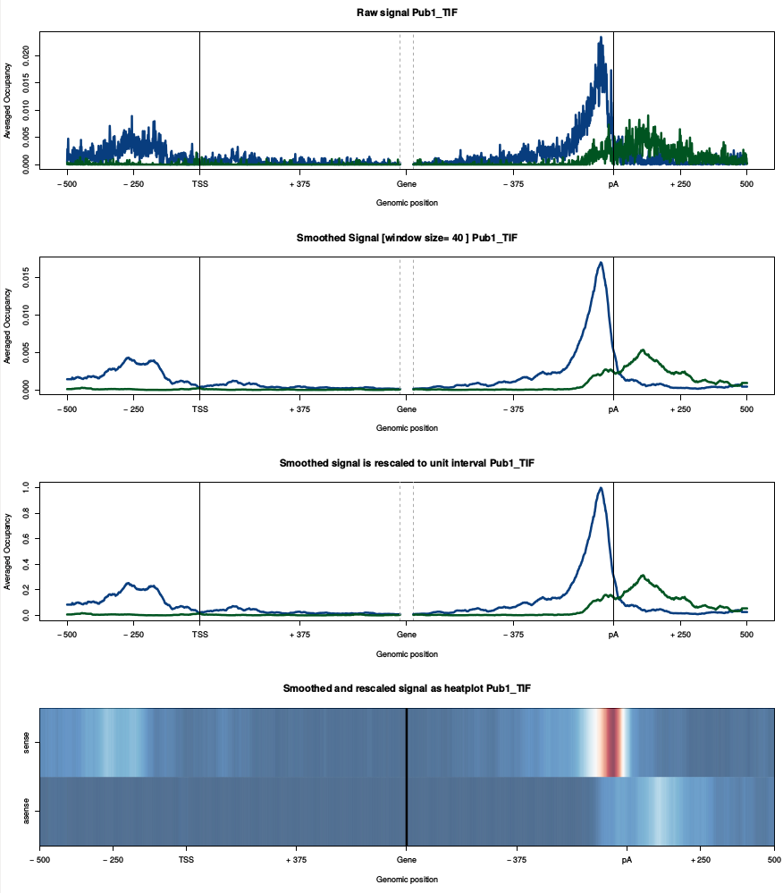

.. _ref_tutorial:

Tutorial
========
`Download tutorial data (1.6GB)  <http://wwwuser.gwdg.de/~compbiol/parclip_stammp/data/data.tar.gz>`_

Here we will analyze a yeast PAR-CLIP data set to make you familiar with STAMMP. Make sure that you have installed the necessary software and that you downloaded and unpacked the tutorial data. For example you maybe unpacked the data.tar.gz into a folder called */tutorial/*. The tutorial was tested under Linux (Ubuntu 14.04).

Pre-Processing
--------------
Let's start by editing the configuration file */tutorial/data/preprocess_tutorial.config* for the :mod:`~stammp.scripts.preprocess` script. Open the configuration file with a text-editor and find the following entries::
    
    [basic.options]
    adapter5prime = GTTCAGAGTTCTACAGTCCGACGATC
    adapter3prime = TGGAATTCTCGGGTGCCAAGG
    bowtieindex = /media/hd2/tutorial/data/bowtie_index/genome
    genomefasta = /media/hd2/tutorial/data/yeast_genome/genome.fa
    rmTemp = Y ; boolean [Y/N] remove temporary files after finishing
    fx_Q33 = Y ; boolean [Y/N] Only important if you use the FastxToolkit. Use Sanger or Illumina scores

You only have to change the *bowtieindex* and *genomeindex* variables so that they point to the correct location on your computer. The tutorial data contains the bowtie index and the yeast genome. You will find them at */tutorial/data/bowtie_index/* and */tutorial/data/yeast_genome/genome.fa*.

Open a terminal and change to the directory where you unpacked the tutorial data. Let's assume it is the */tutorial/* directory::
    
    $ cd /path/to/tutorial
    
You should find a single directory */data* in your tutorial folder.

You can start the pre-process now::
    
    $ stammp-preprocess data/Pub1_tutorial.fastq preprocessed_pub1/ Pub1 data/preprocess_tutorial.config

The pre-process can take several minutes depending on the CPU power of your computer. However you should see something similar on your terminal right now::
    
    [2016-02-11 15:14:14] ##### FastX toolkit analysis of raw data ###########
    
    [2016-02-11 15:15:44] ##### 5prime adapter removal ###########
        Total raw reads: 24398752
    
    
The pre-process finished successfully if you see::
    
    [2016-02-11 15:29:41] ##### Generating mPileup ############################
    [2016-02-11 15:30:39] ##### PreProcess completed ############################

You should see a new folder *preprocessed_pub1* in your */tutorial/* directory and */tutorial/preprocessed_pub1/* should look like this:

.. image:: img/img_preprocess.png
    :align: center
    :height: 138px
    :alt: alternate text

*Pub1.mpileup* serves as input for the following binding site detection.

.. warning:: Make sure, that you know how you should name your files and chromosomes if you start analyzing your own data! (see: :ref:`ref_pre-processing_names`)

Binding-site-detection and normalization
----------------------------------------
We can start the binding site detection by using :mod:`~stammp.scripts.bsfinder` with::
    
    $ stammp-bsfinder preprocessed_pub1/Pub1.mpileup tutorial_output/Pub1_raw.table -p 0.005 -c 4 -v
    

You'll notice some Scipy warnings or errors while the binding site detection is running. You can ignore these outputs. The script saves the detected binding sites in */tutorial/tutorial_output/Pub1_raw.table* which should look similar to this::
    
    chromosome      position        m       r       pvalue  strand  occ
    chrI    31511   2       17      0.0029043207704720323   -       0
    chrI    31565   2       14      0.0021427963039220357   -       0
    chrI    31566   2       14      0.0021427963039220357   -       0
    chrI    31696   3       9       0.00040153529452807333  -       0

Up to now, the last column *occ* which shows the occupancy of a binding site to RNA is only 0, because we haven't included RNA-seq information yet. To do so we'll use the normalization script :mod:`~stammp.scripts.normalize` to divide the *m* counts by RNA-seq data with::
    
    $ stammp-normalize tutorial_output/Pub1_raw.table tutorial_output/Pub1_normalized.table data/RNAseq/Raw_R2_FOR.mpileup,data/RNAseq/Raw_R2_REV.mpileup chrI,chrII,chrIII,chrIV,chrV,chrVI,chrVII,chrVIII,chrIX,chrX,chrXI,chrXII,chrXIII,chrXIV,chrXV,chrXVI,chrmt,chrMT -s 0,0 -v
    

.. warning:: Make sure that you checked the orientation of your RNAseq reads if you work with your own data sets and that you used the same preprocessing for your RNA-seq data! (see :ref:`ref_normalization_s`)

Lastly, we set the maximum value to the .95 quantile of the data with :mod:`~stammp.scripts.convert2quantile` ::
    
    $ stammp-convert2quantile tutorial_output/Pub1_normalized.table tutorial_output/Pub1_normalized_q95.table -q 0.95
    
The final file *tutorial_output/Pub1_normalized_q95.table* contains all significant binding sites and the approximated occupacies. This file serves as input for all subsequent post-processing steps.

Post-Processing
---------------
Most of the post-processing steps consists of a pair of scripts. Typically, a Python-script that collects, transforms and saves the data used for plotting and a second R-script that reads the stored data and generates the final plots. If you call the command line scripts the data as well as the plot is generated. If you don't not want to keep the data used for plotting the scripts will automatically remove the data when called via the *--remove* option. 

During data analysis you will often work with R or Python session where you like to interactively try out ideas or look for similarities in PAR-CLIP data of different experiments. Hence, it is a good idea to keep the data used for the plots. By saving all relevant data for plotting you can always come back to already calculated data sets and can modify existing plotting scripts to your needs or develop your own plotting scripts from scratch.

You can find a list of the available plots and their parameter descriptions at :ref:`ref_plotting`. You also find usage and parameter descriptions if you use the *--help* parameter for a script name. For example::
    
    $ stammp-makeCenterBothEnds --help
    

Center-Plots
^^^^^^^^^^^^
Let's start our analysis with a *center-plot* build with :mod:`~stammp.plots.makeCenterBothEnds` . A *center-plot* shows the PAR-CLIP data in sense and anti-sense direction around given start and stop positions of genomic features. To make a center plot, we need the PAR-CLIP data (from the section before) and a GFF file which contains the genomic features. 

.. warning:: Note, that the chromosome names in the GFF are identical to the names that have been used for the pre-processing of the data. Make sure, that this is true for your own data. Otherwise you won't be able to plot anything (see :ref:`ref_pre-processing_names`).

In this specific example we use mRNA annotations which means that the positions in the GFF are the TSS and the pA of mRNAs. The GFF is located at */tutorial/data/yeast_TIF_annotation.gff*. The *-d -u -g* parameters are used to set the ranges we like to plot. 
    * **-d** specifies the number of nt downstream of an stop position which is 500 nt downstream of the pA site in this exmaple
    * **-u** specifies the number of nt upstream of an start position which is 500 nt upstream of the TSS in this example
    * **-g** specifies the number of nt downstream of a start position and upstream of a stop position of an annotation. In this example it is 750nt so we will get the data for TSS+750 nt and pA-750 nt

You can also filter for specifc annotations sizes between a minimum and maximum size. We set --min to 1500 and --max to 4000 which means that we get the PAR-CLIP data of mRNAs between 1500 and 4000nt size. We also set label names for the axis in the plots. The filenames are generated out of the used parameters::
    
    $ stammp-makeCenterBothEnds tutorial_output/Pub1_normalized_q95.table tutorial_output/ Pub1_TIF data/yeast_TIF_annotation.gff -d 500 -u 500 -g 750 --min 1500 --max 4000 --plotSmooth 20 --labelCenterA TSS --labelBody Gene --labelCenterB pA -r
    
You should find a file named *Pub1_mRNA_centerBoth_up500_gene750_do500_min1500_max4000_TSS_Gene_pA_sm20.pdf* in the *tutorial/tutorial_output/* directory which should look like:
    

k-mer count per sequence position
^^^^^^^^^^^^^^^^^^^^^^^^^^^^^^^^^
Next, let's examine if there are any k-mers that might be enriched around our PAR-CLIP crosslink site. We will use the :mod:`~stammp.plots.makeKmerPerPosition` script to answer this question. 

Basically, we define how we would like to sort our PAR-CLIP sites. The default is *occupancy*. After sorting the binding sites the script selects genomic sequences from the genome and counts the number of occurences per kmer per position in the sequence. You can run the script via::
    
    $ stammp-makeKmerPerPosition tutorial_output/Pub1_normalized_q95.table data/yeast_genome/genome.fa tutorial_output/ Pub1 --kmer 4 --start 0 --stop 2000 --width 50 --key occ -r
    
The resulting plot shows you the k-mer counts per position for top 2000 PAR-CLIP sites sorted by occupancy. The output on stdout shows you the 10 highest peaks. This order is also used for the legend in the plot. Your should find a plot *Pub1_kmerPerPosition_kmer4_start0_stop2000_width50_sort_occ.pdf* in your *tutorial/tutorial_output/* directory which should look like:

.. image:: img/img_kmerPerPosition.png
   :align: center
   :width: 700px
   :alt: alternate text

XXmotif analysis
^^^^^^^^^^^^^^^^
It is usefull to look for factor specific sequence specificities. We use XXmotif to examine our CLIP data for binding specificities. In principle, XXmotif searches for overrepresented kmers in the positive (the PAR-CLIP data) set. However, background frequencies have to be estimated to calculate overerepresntations. Normally, XXmotif uses the positive set to estimate these background frequencies. PAR-CLIP data can be so specific that these background estimations are simply wrong which would result in no motifs. Thus, we recommend to provide XXmotif with a separate negative set which should be a good random sample. STAMMP provides with :mod:`~stammp.scripts.makeNegSets` a script to generate these negative sets from a given annotation and the corresponding genomic sequence. You can find a random sample from the yeast transcriptome at *tutorial/data/negSets/*. If you like to make your own negative set you can try::
    
    stammp-makeNegSets data/yeast_TIF_annotation.gff data/yeast_genome/genome.fa RNA_tut tutorial_output/ --number 50000 --width 20 -v
    

Let's pass the PAR-CLIP data together with a negative set to :mod:`~stammp.scripts.xxmotif`. Note, that you should use only the normalized PAR-CLIP table and not the table resulting after using :mod:`~stammp.scripts.convert2quantile`, because in default settings the PAR-CLIP sites are sorted according to their occupancy. Thus, it is mandatory to use the non-converted file to obtain the correct order. You can start :mod:`~stammp.scripts.xxmotif` via::
    
    $ stammp-xxmotif tutorial_output/Pub1_normalized.table data/yeast_genome/genome.fa tutorial_output/xxmotif/ Pub1 --negSet data/negSets/rnd_sequences_RNA_50000_w20.fa --plotPWM 2
    

How to proceed?
^^^^^^^^^^^^^^^
Go to :ref:`ref_plotting` to see which other automated analysis plots are available or take a look at :ref:`ref_general` to build your own analysis.

